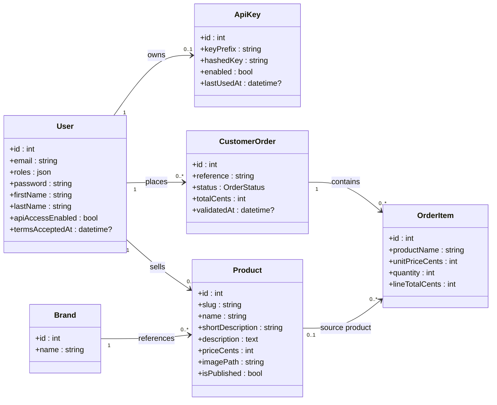
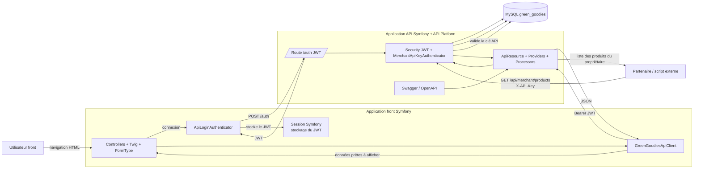

# Architecture GreenGoodies

Ce document regroupe :

- un diagramme de classe représentant la base de données de l'API ;
- un schéma d'architecture pour expliquer le fonctionnement global du projet.

## Diagramme de classe de la base de données

### Points clés du modèle de données

- `User` représente un compte client pouvant aussi devenir vendeur et activer un accès API commerçant.
- `ApiKey` est liée en `1-1` à `User` et ne stocke jamais la clé en clair : seul le hash est conservé.
- `Product` appartient à une `Brand` et peut être rattaché à un vendeur (`seller`) si le produit a été créé par un utilisateur.
- `CustomerOrder` sert à la fois de panier et de commande validée.
- `OrderItem` stocke un snapshot du produit au moment de l'achat (`productName`, `unitPriceCents`) pour préserver l'historique.
- Toutes les entités principales utilisent aussi `createdAt` et `updatedAt` via `TimestampableTrait`.

## Schéma de fonctionnement du projet

### Lecture du schéma

- Le `front/` ne parle jamais directement à la base.
- Toute la donnée métier transite par `api/`.
- La connexion utilisateur se fait contre l'API via `/auth`, puis le JWT est conservé en session côté front.
- Les actions authentifiées du front utilisent ensuite ce JWT pour appeler l'API.
- Les routes commerçant utilisent un second mode d'authentification, indépendant du JWT, via `X-API-Key`.
- Swagger documente l'API, mais l'exécution métier est portée par API Platform, Doctrine et la couche de sécurité Symfony.

## Flux principaux à retenir

### 1. Consultation du catalogue

- Le navigateur appelle le front.
- Le front appelle `GET /api/products`.
- L'API lit la base puis retourne le JSON.
- Le front rend la page Twig.

### 2. Connexion utilisateur

- L'utilisateur soumet le formulaire sur le front.
- Le custom authenticator du front appelle `POST /auth`.
- L'API retourne un JWT.
- Le front stocke ce JWT en session puis utilise `GET /api/me` pour hydrater l'utilisateur connecté.

### 3. Ajout d'un produit

- Le formulaire Symfony est affiché par le front.
- Le front soumet les données à l'API avec le JWT.
- API Platform désérialise `Product`, puis [ProductProcessor](/Users/Julien/Documents/Sites/Developpeur/FORMATION_OCR/GreenGoodies/api/src/ApiState/ProductProcessor.php) complète les règles métier.
- Doctrine persiste le produit en base.

### 4. Gestion du panier

- Le front appelle `/api/cart`, `/api/cart/items/{slug}`, `/api/cart/clear` ou `/api/cart/checkout`.
- Les processors/providers de panier s'appuient sur [CartManager](/Users/Julien/Documents/Sites/Developpeur/FORMATION_OCR/GreenGoodies/api/src/Service/CartManager.php).
- Le panier correspond à une `CustomerOrder` en statut `draft`.
- Lors du checkout, le statut passe à `validated`.

### 5. Accès API commerçant

- L'utilisateur active sa clé API depuis son compte.
- L'API génère une clé en clair une seule fois et n'en conserve que le hash.
- Un partenaire externe appelle `/api/merchant/products` avec `X-API-Key`.
- [MerchantApiKeyAuthenticator](/Users/Julien/Documents/Sites/Developpeur/FORMATION_OCR/GreenGoodies/api/src/Security/MerchantApiKeyAuthenticator.php) authentifie le propriétaire de la clé.
- [MerchantProductsProvider](/Users/Julien/Documents/Sites/Developpeur/FORMATION_OCR/GreenGoodies/api/src/ApiState/MerchantProductsProvider.php) retourne uniquement ses produits.
