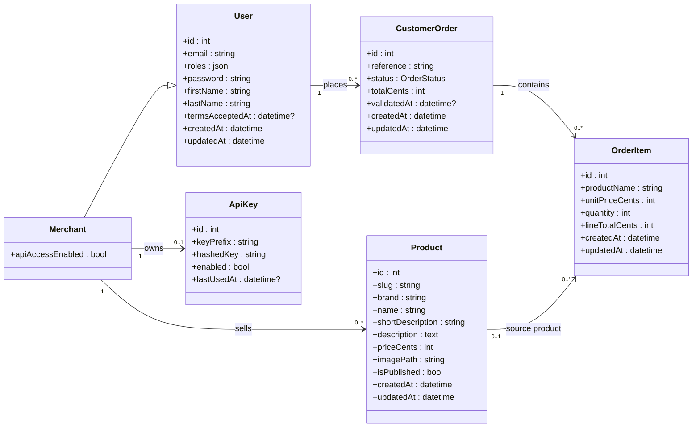
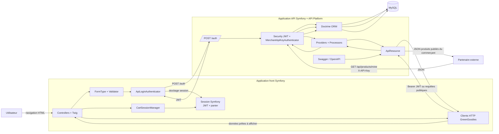

# Architecture GreenGoodies

Ce document présente l'architecture actuelle du projet :

- le modèle de données réellement utilisé côté API ;
- le fonctionnement global entre le front Symfony et l'API REST ;
- les principaux flux métier à connaître pour expliquer l'application.

## Diagramme de classe de la base de données

```mermaid
classDiagram
direction LR

class User {
  +id : int
  +email : string
  +roles : json
  +password : string
  +firstName : string
  +lastName : string
  +termsAcceptedAt : datetime?
  +createdAt : datetime
  +updatedAt : datetime
}

class Merchant {
  +apiAccessEnabled : bool
}

class ApiKey {
  +id : int
  +keyPrefix : string
  +hashedKey : string
  +enabled : bool
  +lastUsedAt : datetime?
}

class Product {
  +id : int
  +slug : string
  +brand : string
  +name : string
  +shortDescription : string
  +description : text
  +priceCents : int
  +imagePath : string
  +isPublished : bool
  +createdAt : datetime
  +updatedAt : datetime
}

class CustomerOrder {
  +id : int
  +reference : string
  +status : OrderStatus
  +totalCents : int
  +validatedAt : datetime?
  +createdAt : datetime
  +updatedAt : datetime
}

class OrderItem {
  +id : int
  +productName : string
  +unitPriceCents : int
  +quantity : int
  +lineTotalCents : int
  +createdAt : datetime
  +updatedAt : datetime
}

Merchant --|> User
Merchant "1" --> "0..1" ApiKey : owns
Merchant "1" --> "0..*" Product : sells
User "1" --> "0..*" CustomerOrder : places
CustomerOrder "1" --> "0..*" OrderItem : contains
Product "0..1" --> "0..*" OrderItem : source product
```

### Points clés du modèle de données

- `User` représente le socle commun des comptes applicatifs : identité, mot de passe, rôles, acceptation des CGU, timestamps.
- `Merchant` étend `User` avec l'héritage Doctrine `SINGLE_TABLE` et un discriminator `account_type`. Un commerçant est donc un utilisateur spécialisé, pas une table séparée.
- `ApiKey` est liée en `1-1` à `Merchant`. La clé n'est jamais conservée en clair : seul son hash est persisté, avec un préfixe lisible et une date de dernière utilisation.
- `Product` porte directement sa marque via `brand`. Il peut être public (`isPublished = true`) et/ou rattaché à un commerçant via `seller`.
- `CustomerOrder` est une commande persistée. Le modèle supporte plusieurs statuts (`draft`, `validated`, `cancelled`), même si le front crée aujourd'hui directement des commandes validées au checkout.
- `OrderItem` stocke un snapshot du produit acheté (`productName`, `unitPriceCents`) pour préserver l'historique même si le produit évolue ensuite.
- Toutes les entités métier principales réutilisent `TimestampableTrait` pour `createdAt` et `updatedAt`.

## Schéma de fonctionnement du projet

```mermaid
flowchart LR
    U[Utilisateur]
    P[Partenaire externe]

    subgraph FRONT[Application front Symfony]
        TWIG[Controllers + Twig]
        FORM[FormType + Validator]
        SESSION[Session Symfony<br/>JWT + panier]
        CART[CartSessionManager]
        HTTP[Clients HTTP GreenGoodies]
        AUTH[ApiLoginAuthenticator]
    end

    subgraph API[Application API Symfony + API Platform]
        LOGIN[/POST /auth/]
        RES[ApiResource]
        STATE[Providers + Processors]
        SEC[Security JWT + MerchantApiKeyAuthenticator]
        ORM[Doctrine ORM]
        DOC[Swagger / OpenAPI]
    end

    DB[(MySQL)]

    U -->|navigation HTML| TWIG
    TWIG --> FORM
    FORM --> AUTH
    AUTH -->|POST /auth| LOGIN
    LOGIN --> SEC
    SEC --> ORM
    ORM --> DB
    LOGIN -->|JWT| AUTH
    AUTH -->|stockage session| SESSION

    TWIG --> CART
    CART --> SESSION

    TWIG --> HTTP
    HTTP -->|Bearer JWT ou requêtes publiques| RES
    RES --> STATE
    STATE --> SEC
    SEC --> ORM
    ORM --> DB
    RES -->|JSON| HTTP
    HTTP -->|données prêtes à afficher| TWIG

    P -->|GET /api/products/mine<br/>X-API-Key| SEC
    SEC --> ORM
    ORM --> DB
    SEC --> STATE
    STATE --> RES
    RES -->|JSON produits publiés du commerçant| P

    DOC --> RES
```

### Lecture du schéma

- Le `front/` ne parle jamais directement à la base de données.
- Le `front/` gère l'affichage, les formulaires Symfony, la session et la sécurité locale.
- L'`api/` centralise la logique métier, la persistance Doctrine et l'exposition REST des ressources.
- Le JWT obtenu via `/auth` est stocké en session côté front pour les appels ultérieurs vers les routes protégées.
- Le panier n'est plus géré par l'API : il est stocké côté front en session sous la forme minimale `slug => quantité`.
- L'écran `Mon compte` est composé à partir de plusieurs ressources REST ciblées (`/api/users/me`, `/api/users/me/orders`, `/api/users/me/products`) au lieu d'une vue API agrégée dédiée.
- L'accès partenaire utilise une authentification séparée par clé API `X-API-Key` sur `/api/products/mine`, indépendante du JWT front.

## Routes métier principales

### Front

- `GET /` : page d'accueil avec catalogue.
- `GET /produits/{slug}` : fiche produit.
- `GET|POST /connexion` : formulaire de connexion front.
- `GET|POST /inscription` : formulaire d'inscription.
- `GET /mon-panier` : affichage du panier session.
- `POST /mon-panier/articles/{slug}` : ajout, mise à jour ou suppression d'une ligne de panier.
- `POST /mon-panier/vider` : vidage du panier.
- `POST /mon-panier/valider` : création d'une commande côté API.
- `GET /mon-compte` : écran compte composé depuis plusieurs ressources API.
- `POST /mon-compte/acces-api` : activation ou désactivation de la clé API commerçant.
- `POST /mon-compte/supprimer` : suppression du compte courant.
- `GET|POST /mes-produits/nouveau` et `GET|POST /mes-produits/{slug}/modifier` : gestion produit côté commerçant.

### API

- `POST /auth` : obtention d'un JWT.
- `POST /api/users` : création d'un compte.
- `GET /api/users/me` : profil courant.
- `DELETE /api/users/me` : suppression du compte courant.
- `POST /api/users/me/api-key/activate` : activation ou régénération de la clé API.
- `POST /api/users/me/api-key/deactivate` : désactivation de la clé API.
- `GET /api/products` : catalogue public.
- `GET /api/products/{slug}` : détail d'un produit publié, ou produit privé du commerçant propriétaire.
- `GET /api/users/me/products` : produits du commerçant connecté côté front.
- `GET /api/products/mine` : produits publiés du commerçant authentifié par clé API.
- `POST /api/products` et `PUT /api/products/{slug}` : création et modification produit.
- `GET /api/users/me/orders` : historique des commandes du compte courant.
- `GET /api/orders/{reference}` : détail d'une commande appartenant à l'utilisateur connecté.
- `POST /api/orders` : création d'une commande validée à partir du panier session du front.

## Flux principaux à retenir

### 1. Consultation du catalogue

- Le navigateur appelle le front.
- Le front appelle `GET /api/products`.
- L'API retourne les produits publiés.
- Le front rend la page Twig d'accueil.

### 2. Connexion utilisateur

- L'utilisateur soumet le formulaire de connexion du front.
- `ApiLoginAuthenticator` appelle `POST /auth`.
- L'API retourne un JWT.
- Le front appelle ensuite `GET /api/users/me` pour reconstruire l'utilisateur Symfony local.
- Le JWT est conservé en session pour les prochains appels API.

### 3. Inscription

- Le front valide le formulaire Symfony localement.
- Il transmet ensuite les données à `POST /api/users`.
- `RegisterUserProcessor` crée soit un `User`, soit un `Merchant` selon `accountType`.

### 4. Gestion du panier et commande

- Le panier est stocké côté front en session via `CartSessionManager`.
- Seuls les couples `slug` / `quantité` sont conservés localement.
- L'affichage du panier réutilise `GET /api/products` pour enrichir les lignes avec les données produit.
- Au checkout, le front transforme la session en payload et appelle `POST /api/orders`.
- `CreateOrderProcessor` crée une `CustomerOrder`, ajoute les `OrderItem`, valide la commande et la persiste.

### 5. Espace compte

- Le front appelle `GET /api/users/me` pour le profil.
- Il appelle `GET /api/users/me/orders` pour l'historique des commandes.
- Si l'utilisateur connecté est commerçant, il appelle aussi `GET /api/users/me/products`.
- Le front compose ensuite l'écran `Mon compte` à partir de ces trois ressources.

### 6. Gestion des produits commerçant

- Le formulaire front envoie les données à `POST /api/products` ou `PUT /api/products/{slug}`.
- `ProductProcessor` vérifie que l'utilisateur connecté est un `Merchant`.
- Le processor rattache automatiquement le produit à son vendeur et génère un slug si nécessaire.

### 7. Accès API commerçant

- Le commerçant active son accès API depuis son compte avec `POST /api/users/me/api-key/activate`.
- L'API génère une clé en clair une seule fois, puis ne conserve que son hash.
- Un partenaire externe appelle `GET /api/products/mine` avec `X-API-Key`.
- `MerchantApiKeyAuthenticator` retrouve le commerçant propriétaire, vérifie que la clé est active et journalise sa dernière utilisation.
- `MerchantProductsProvider` retourne uniquement les produits publiés appartenant à ce commerçant.

## Fichiers de référence utiles

- [README.md](/Users/Julien/Documents/Sites/Developpeur/FORMATION_OCR/GreenGoodies/README.md)
- [front/src/Security/ApiLoginAuthenticator.php](/Users/Julien/Documents/Sites/Developpeur/FORMATION_OCR/GreenGoodies/front/src/Security/ApiLoginAuthenticator.php)
- [front/src/Service/Cart/CartSessionManager.php](/Users/Julien/Documents/Sites/Developpeur/FORMATION_OCR/GreenGoodies/front/src/Service/Cart/CartSessionManager.php)
- [front/src/Controller/Account/ShowAction.php](/Users/Julien/Documents/Sites/Developpeur/FORMATION_OCR/GreenGoodies/front/src/Controller/Account/ShowAction.php)
- [api/src/Entity/User.php](/Users/Julien/Documents/Sites/Developpeur/FORMATION_OCR/GreenGoodies/api/src/Entity/User.php)
- [api/src/Entity/Merchant.php](/Users/Julien/Documents/Sites/Developpeur/FORMATION_OCR/GreenGoodies/api/src/Entity/Merchant.php)
- [api/src/Entity/Product.php](/Users/Julien/Documents/Sites/Developpeur/FORMATION_OCR/GreenGoodies/api/src/Entity/Product.php)
- [api/src/Entity/CustomerOrder.php](/Users/Julien/Documents/Sites/Developpeur/FORMATION_OCR/GreenGoodies/api/src/Entity/CustomerOrder.php)
- [api/src/ApiState/Product/ProductProcessor.php](/Users/Julien/Documents/Sites/Developpeur/FORMATION_OCR/GreenGoodies/api/src/ApiState/Product/ProductProcessor.php)
- [api/src/ApiState/Order/CreateOrderProcessor.php](/Users/Julien/Documents/Sites/Developpeur/FORMATION_OCR/GreenGoodies/api/src/ApiState/Order/CreateOrderProcessor.php)
- [api/src/Security/MerchantApiKeyAuthenticator.php](/Users/Julien/Documents/Sites/Developpeur/FORMATION_OCR/GreenGoodies/api/src/Security/MerchantApiKeyAuthenticator.php)
